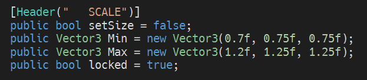
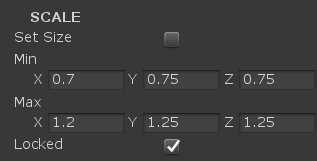
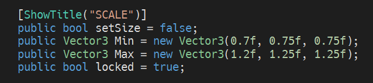
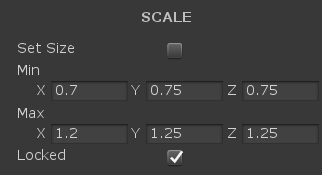
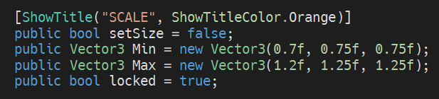
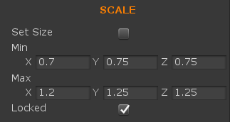
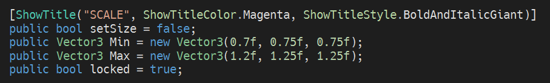
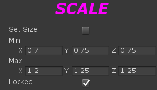
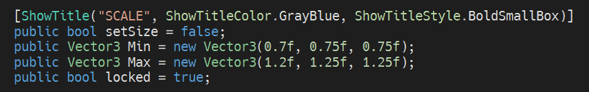

# ShowTitleHeader
It is a nicer header to add to your Unity Components.

EXAMPLES

#1 (NORMAL HEADER)

#2 (SHOWTITLE NEUTRAL)

#3 (COLOR ORANGE)

#4  (COLOR & STYLE)

#5 (STYLE PROPERTIES)

#6 (SET ANCHOR)

#7 (COLOR, STYLE AND ANCHOR)

#8 (R, G, B, STYLE, ANCHOR AND FONT SIZE)

